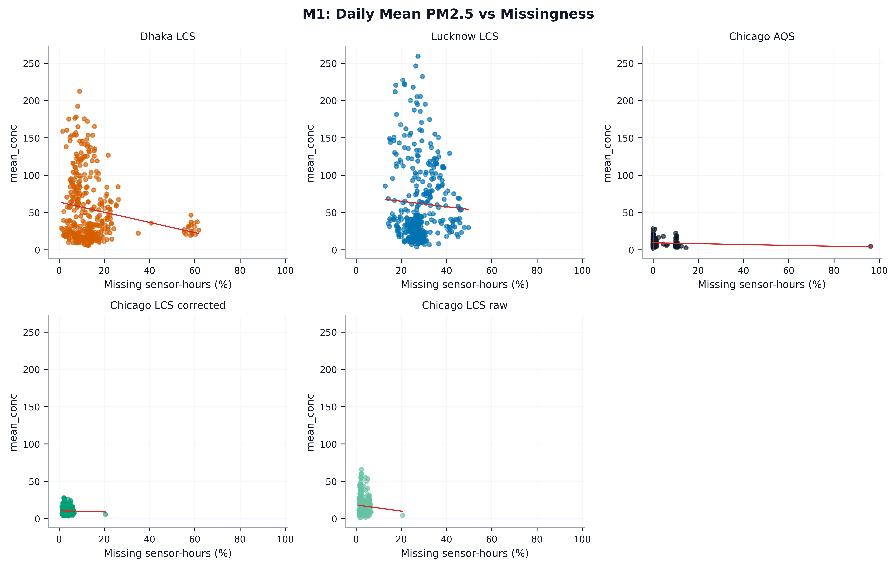
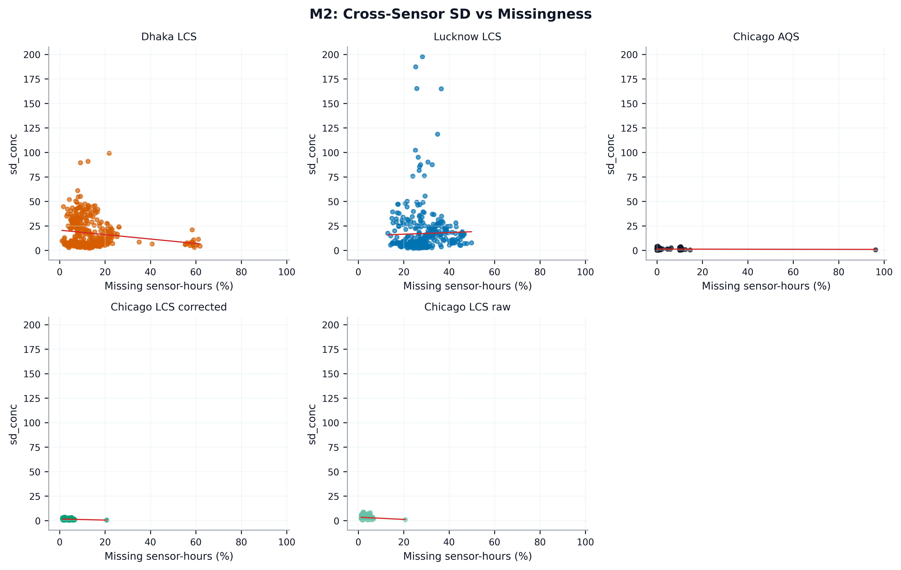
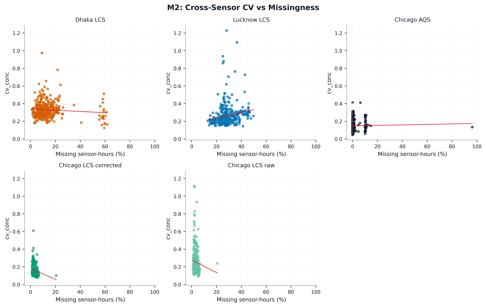
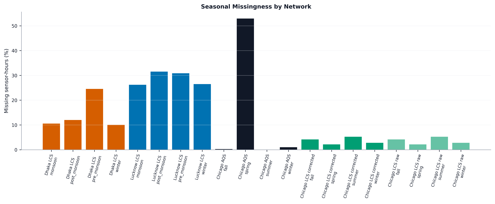
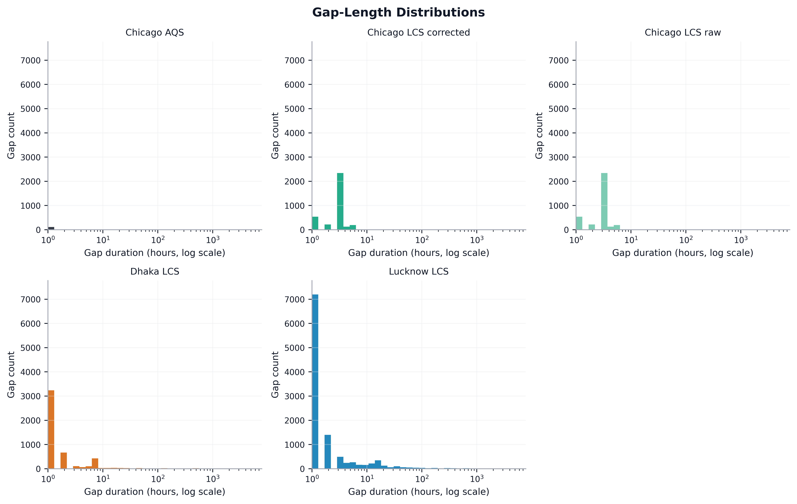
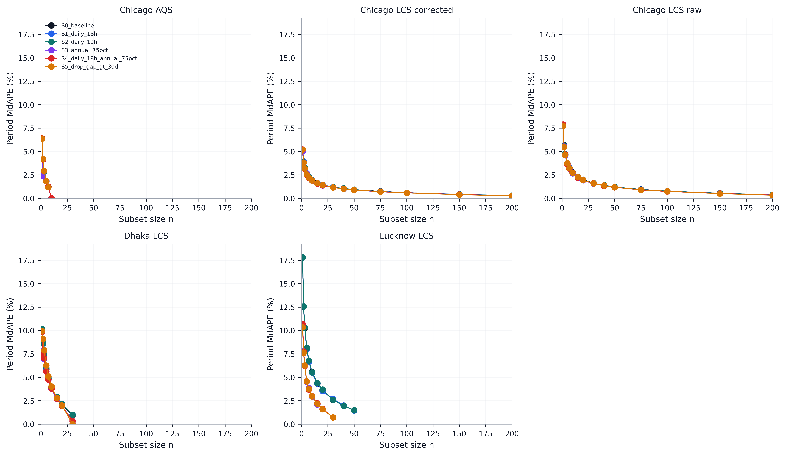
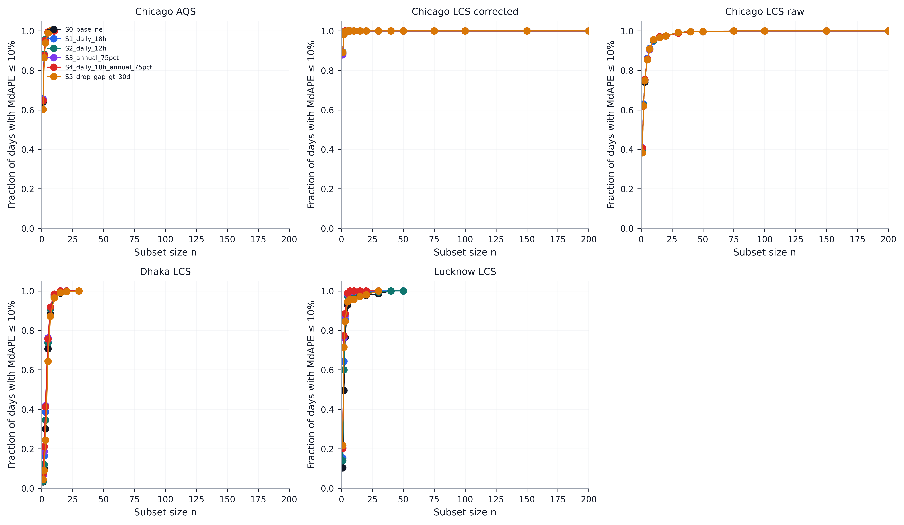
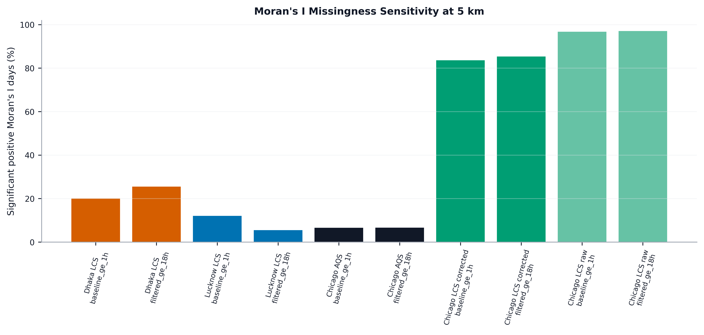

# Missingness Analysis Report

This report is generated from the current canonical wide PM2.5 matrices in `data/pm/`. All generated figures are written as high-resolution PNG and PDF pairs under `missingness/plots/`. The Lucknow Kakori coordinate has been corrected in `data/locations/Lucknow_sensor_locations.csv`; this does not change PM2.5 missingness calculations, but it does affect M6 spatial diagnostics.

## M1 — Concentration vs Missingness

| network | n | pearson_r | pearson_ci_low | pearson_ci_high | spearman_rho |
| --- | --- | --- | --- | --- | --- |
| dhaka_lcs | 365 | -0.185 | -0.234 | -0.134 | -0.127 |
| lucknow_lcs | 365 | -0.0489 | -0.133 | 0.0414 | 0.0618 |
| chicago_aqs | 214 | -0.0828 | -0.168 | 0.0506 | -0.0136 |
| chicago_lcs_corrected | 274 | -0.027 | -0.113 | 0.0853 | 0.0155 |
| chicago_lcs_raw | 274 | -0.0573 | -0.139 | 0.0489 | -0.00677 |

## M2 — Variability vs Missingness

| network | n | pearson_r | pearson_ci_low | pearson_ci_high | spearman_rho |
| --- | --- | --- | --- | --- | --- |
| dhaka_lcs | 365 | -0.183 | -0.244 | -0.117 | -0.133 |
| lucknow_lcs | 365 | 0.0255 | -0.0377 | 0.0991 | 0.154 |
| chicago_aqs | 214 | -0.0302 | -0.121 | 0.174 | 0.0495 |
| chicago_lcs_corrected | 274 | -0.163 | -0.252 | -0.0531 | -0.0919 |
| chicago_lcs_raw | 274 | -0.135 | -0.223 | -0.0224 | -0.0519 |

## M3 — Seasonal Missingness

| network | season | missingness_pct | median_sensor_uptime_pct | days |
| --- | --- | --- | --- | --- |
| dhaka_lcs | monsoon | 10.6 | 94.8 | 122 |
| dhaka_lcs | post_monsoon | 12 | 92.9 | 61 |
| dhaka_lcs | pre_monsoon | 24.6 | 76.7 | 92 |
| dhaka_lcs | winter | 10 | 96.7 | 90 |
| lucknow_lcs | monsoon | 26.2 | 81.7 | 122 |
| lucknow_lcs | post_monsoon | 31.5 | 84.8 | 61 |
| lucknow_lcs | pre_monsoon | 30.9 | 71.3 | 92 |
| lucknow_lcs | winter | 26.5 | 89.1 | 90 |
| chicago_aqs | fall | 0.275 | 99.7 | 91 |
| chicago_aqs | spring | 53 | 50.9 | 61 |
| chicago_aqs | summer | 0 | 100 | 1 |
| chicago_aqs | winter | 1.01 | 99.6 | 90 |
| chicago_lcs_corrected | fall | 4.17 | 100 | 91 |
| chicago_lcs_corrected | spring | 2.16 | 99.8 | 92 |
| chicago_lcs_corrected | summer | 5.24 | 100 | 1 |
| chicago_lcs_corrected | winter | 2.81 | 100 | 90 |
| chicago_lcs_raw | fall | 4.17 | 100 | 91 |
| chicago_lcs_raw | spring | 2.16 | 99.8 | 92 |
| chicago_lcs_raw | summer | 5.24 | 100 | 1 |
| chicago_lcs_raw | winter | 2.81 | 100 | 90 |

| network | winter_vs_nonwinter_ks_stat | winter_vs_nonwinter_ks_p_approx | chi_square_stat | chi_square_p_approx |
| --- | --- | --- | --- | --- |
| dhaka_lcs | 0.275 | 6.85e-05 | 7.88e+03 | 0 |
| lucknow_lcs | 0.198 | 0.00972 | 1.23e+03 | 0 |
| chicago_aqs | 0.284 | 0.00021 | 2.17e+04 | 0 |
| chicago_lcs_corrected | 0.168 | 0.066 | 4.35e+03 | 0 |
| chicago_lcs_raw | 0.168 | 0.066 | 4.35e+03 | 0 |

## M4 — Gap-Length Characterization

| network | gap_count | median_gap_hours | p95_gap_hours | max_gap_hours | gap_gt_30d_count |
| --- | --- | --- | --- | --- | --- |
| dhaka_lcs | 4890 | 1 | 13 | 1116 | 6 |
| lucknow_lcs | 11114 | 1 | 23 | 7841 | 48 |
| chicago_aqs | 140 | 1 | 714 | 1256 | 1 |
| chicago_lcs_corrected | 3527 | 3 | 5 | 4349 | 25 |
| chicago_lcs_raw | 3527 | 3 | 5 | 4349 | 25 |

### Long Gaps > 30 Days

| network | sensor_id | start_timestamp | end_timestamp | duration_hours | season_midpoint | gap_minus_overall_network_mean |
| --- | --- | --- | --- | --- | --- | --- |
| chicago_aqs | 17-031-0076 | 2026-03-09 11:00:00-05:00 | 2026-04-30 18:00:00-05:00 | 1256 | spring | -0.142 |
| chicago_lcs_corrected | DJJWX4142 | 2025-12-01 18:00:00-06:00 | 2026-05-31 23:00:00-05:00 | 4349 | spring | 0.42 |
| chicago_lcs_corrected | DMAEX1156 | 2025-12-10 13:00:00-06:00 | 2026-05-31 23:00:00-05:00 | 4138 | spring | 0.0938 |
| chicago_lcs_corrected | DEYGE9157 | 2026-02-10 20:00:00-06:00 | 2026-05-31 23:00:00-05:00 | 2643 | spring | -0.456 |
| chicago_lcs_corrected | DSSQU9498 | 2025-08-31 19:00:00-05:00 | 2025-12-13 09:00:00-06:00 | 2488 | fall | -0.00868 |
| chicago_lcs_corrected | DDVZB7943 | 2025-12-16 02:00:00-06:00 | 2026-03-07 09:00:00-06:00 | 1952 | winter | 1.77 |
| chicago_lcs_corrected | DUVHI0112 | 2026-01-23 05:00:00-06:00 | 2026-04-11 14:00:00-05:00 | 1881 | spring | 1.08 |
| chicago_lcs_corrected | DXHCB5919 | 2025-10-05 18:00:00-05:00 | 2025-12-13 06:00:00-06:00 | 1646 | fall | -0.293 |
| chicago_lcs_corrected | DBASA0396 | 2025-08-31 19:00:00-05:00 | 2025-11-07 11:00:00-06:00 | 1626 | fall | -1.15 |
| chicago_lcs_corrected | DDFTD2975 | 2025-08-31 19:00:00-05:00 | 2025-11-07 11:00:00-06:00 | 1626 | fall | -1.15 |
| chicago_lcs_corrected | DGEPF8361 | 2025-08-31 19:00:00-05:00 | 2025-11-07 11:00:00-06:00 | 1626 | fall | -1.15 |
| chicago_lcs_corrected | DWKUZ0134 | 2025-08-31 19:00:00-05:00 | 2025-11-05 10:00:00-06:00 | 1577 | fall | -1.15 |
| chicago_lcs_corrected | DIPDE7442 | 2025-08-31 19:00:00-05:00 | 2025-11-05 09:00:00-06:00 | 1576 | fall | -1.15 |
| chicago_lcs_corrected | DLAIF4030 | 2025-08-31 19:00:00-05:00 | 2025-11-05 09:00:00-06:00 | 1576 | fall | -1.15 |
| chicago_lcs_corrected | DUVHI0112 | 2025-10-09 01:00:00-05:00 | 2025-12-13 08:00:00-06:00 | 1569 | fall | -0.094 |
| chicago_lcs_corrected | DYDVV6312 | 2025-08-31 19:00:00-05:00 | 2025-10-29 07:00:00-05:00 | 1405 | fall | -1.04 |
| chicago_lcs_corrected | DFQDK6326 | 2025-10-01 07:00:00-05:00 | 2025-11-22 15:00:00-06:00 | 1258 | fall | -1.98 |
| chicago_lcs_corrected | DFQDK6326 | 2026-04-24 10:00:00-05:00 | 2026-05-31 23:00:00-05:00 | 902 | spring | -2.43 |
| chicago_lcs_corrected | DMLRY2750 | 2026-04-26 23:00:00-05:00 | 2026-05-31 23:00:00-05:00 | 841 | spring | -2.48 |
| chicago_lcs_corrected | DFIBC1899 | 2025-08-31 19:00:00-05:00 | 2025-10-04 08:00:00-05:00 | 806 | fall | 0.542 |
| chicago_lcs_corrected | DJJWX4142 | 2025-08-31 19:00:00-05:00 | 2025-10-04 07:00:00-05:00 | 805 | fall | 0.537 |
| chicago_lcs_corrected | DUVHI0112 | 2025-08-31 19:00:00-05:00 | 2025-10-04 07:00:00-05:00 | 805 | fall | 0.537 |
| chicago_lcs_corrected | DXHCB5919 | 2025-08-31 19:00:00-05:00 | 2025-10-04 07:00:00-05:00 | 805 | fall | 0.537 |
| chicago_lcs_corrected | DEQFM3089 | 2025-08-31 19:00:00-05:00 | 2025-10-03 11:00:00-05:00 | 785 | fall | 0.46 |
| chicago_lcs_corrected | DFNHF0256 | 2025-08-31 19:00:00-05:00 | 2025-10-03 11:00:00-05:00 | 785 | fall | 0.46 |
| chicago_lcs_corrected | DVYCN4987 | 2025-08-31 19:00:00-05:00 | 2025-10-03 11:00:00-05:00 | 785 | fall | 0.46 |
| chicago_lcs_raw | DJJWX4142 | 2025-12-01 18:00:00-06:00 | 2026-05-31 23:00:00-05:00 | 4349 | spring | 1.13 |
| chicago_lcs_raw | DMAEX1156 | 2025-12-10 13:00:00-06:00 | 2026-05-31 23:00:00-05:00 | 4138 | spring | 0.12 |
| chicago_lcs_raw | DEYGE9157 | 2026-02-10 20:00:00-06:00 | 2026-05-31 23:00:00-05:00 | 2643 | spring | -1.72 |
| chicago_lcs_raw | DSSQU9498 | 2025-08-31 19:00:00-05:00 | 2025-12-13 09:00:00-06:00 | 2488 | fall | 0.159 |

## M5 — Completeness-Threshold Sensitivity

This run uses Monte Carlo subsampling on the current wide matrices with 10,000 period iterations and 10,000 daily iterations per n. M5 was run with `12` worker process(es) across independent network-scenario tasks, using deterministic per-network-scenario seeds derived from master seed `20260522`. Use lower `--mc-iterations` values only for development/screening runs.

| network | scenario | retained_sensors | period_required_n_mdape_le_5 | daily_required_n_95pct_days_mdape_le_10 | median_daily_valid_sensors |
| --- | --- | --- | --- | --- | --- |
| chicago_aqs | S0_baseline | 10 | 2 | 5 | 10 |
| chicago_aqs | S1_daily_18h | 10 | 1 | 3 | 10 |
| chicago_aqs | S2_daily_12h | 10 | 1 | 3 | 10 |
| chicago_aqs | S3_annual_75pct | 10 | 1 | 5 | 10 |
| chicago_aqs | S4_daily_18h_annual_75pct | 10 | 2 | 3 | 10 |
| chicago_aqs | S5_drop_gap_gt_30d | 9 | 2 | 5 | 9 |
| chicago_lcs_corrected | S0_baseline | 286 | 2 | 2 | 281 |
| chicago_lcs_corrected | S1_daily_18h | 286 | 2 | 2 | 279 |
| chicago_lcs_corrected | S2_daily_12h | 286 | 2 | 2 | 279 |
| chicago_lcs_corrected | S3_annual_75pct | 278 | 2 | 2 | 277 |
| chicago_lcs_corrected | S4_daily_18h_annual_75pct | 278 | 2 | 2 | 275 |
| chicago_lcs_corrected | S5_drop_gap_gt_30d | 266 | 2 | 2 | 265 |
| chicago_lcs_raw | S0_baseline | 286 | 3 | 10 | 281 |
| chicago_lcs_raw | S1_daily_18h | 286 | 3 | 15 | 279 |
| chicago_lcs_raw | S2_daily_12h | 286 | 3 | 10 | 279 |
| chicago_lcs_raw | S3_annual_75pct | 278 | 3 | 10 | 277 |
| chicago_lcs_raw | S4_daily_18h_annual_75pct | 278 | 3 | 10 | 275 |
| chicago_lcs_raw | S5_drop_gap_gt_30d | 266 | 3 | 10 | 265 |
| dhaka_lcs | S0_baseline | 35 | 7 | 10 | 33 |
| dhaka_lcs | S1_daily_18h | 35 | 7 | 10 | 30 |
| dhaka_lcs | S2_daily_12h | 35 | 7 | 10 | 32 |
| dhaka_lcs | S3_annual_75pct | 31 | 7 | 10 | 30 |
| dhaka_lcs | S4_daily_18h_annual_75pct | 31 | 7 | 10 | 28 |
| dhaka_lcs | S5_drop_gap_gt_30d | 30 | 10 | 10 | 29 |
| lucknow_lcs | S0_baseline | 71 | 15 | 7 | 56 |
| lucknow_lcs | S1_daily_18h | 71 | 15 | 5 | 50 |
| lucknow_lcs | S2_daily_12h | 71 | 15 | 5 | 53 |
| lucknow_lcs | S3_annual_75pct | 34 | 5 | 5 | 31 |
| lucknow_lcs | S4_daily_18h_annual_75pct | 34 | 5 | 5 | 30 |
| lucknow_lcs | S5_drop_gap_gt_30d | 34 | 5 | 7 | 31 |

## M6 — Moran's I Completeness Sensitivity

Moran's I p-values use an analytical normal approximation for a fast screening run. The final SI run should use the same table structure and may increase rigor with permutation p-values if needed.

| network | filter | distance_band_km | days_evaluated | median_moran_i | significant_positive_days_pct |
| --- | --- | --- | --- | --- | --- |
| dhaka_lcs | baseline_ge_1h | 2 | 365 | 0.0657 | 7.95 |
| dhaka_lcs | baseline_ge_1h | 5 | 365 | -0.00328 | 20 |
| dhaka_lcs | baseline_ge_1h | 10 | 365 | -0.0238 | 18.6 |
| dhaka_lcs | filtered_ge_18h | 2 | 364 | 0.0559 | 8.52 |
| dhaka_lcs | filtered_ge_18h | 5 | 365 | 0.000424 | 25.5 |
| dhaka_lcs | filtered_ge_18h | 10 | 365 | -0.02 | 19.5 |
| lucknow_lcs | baseline_ge_1h | 2 | 365 | -0.0448 | 0.274 |
| lucknow_lcs | baseline_ge_1h | 5 | 365 | 0.00368 | 12.1 |
| lucknow_lcs | baseline_ge_1h | 10 | 365 | -0.0141 | 14 |
| lucknow_lcs | filtered_ge_18h | 2 | 365 | -0.0654 | 0 |
| lucknow_lcs | filtered_ge_18h | 5 | 365 | -0.0237 | 5.48 |
| lucknow_lcs | filtered_ge_18h | 10 | 365 | -0.0137 | 15.3 |
| chicago_aqs | baseline_ge_1h | 2 | 0 |  |  |
| chicago_aqs | baseline_ge_1h | 5 | 214 | -0.122 | 6.54 |
| chicago_aqs | baseline_ge_1h | 10 | 214 | -0.143 | 3.74 |
| chicago_aqs | filtered_ge_18h | 2 | 0 |  |  |
| chicago_aqs | filtered_ge_18h | 5 | 211 | -0.125 | 6.64 |
| chicago_aqs | filtered_ge_18h | 10 | 212 | -0.153 | 3.77 |
| chicago_lcs_corrected | baseline_ge_1h | 2 | 274 | 0.119 | 77.4 |
| chicago_lcs_corrected | baseline_ge_1h | 5 | 274 | 0.086 | 83.6 |
| chicago_lcs_corrected | baseline_ge_1h | 10 | 274 | 0.0495 | 84.3 |
| chicago_lcs_corrected | filtered_ge_18h | 2 | 273 | 0.117 | 76.2 |
| chicago_lcs_corrected | filtered_ge_18h | 5 | 273 | 0.0868 | 85.3 |
| chicago_lcs_corrected | filtered_ge_18h | 10 | 273 | 0.0482 | 85 |
| chicago_lcs_raw | baseline_ge_1h | 2 | 274 | 0.227 | 98.9 |
| chicago_lcs_raw | baseline_ge_1h | 5 | 274 | 0.148 | 96.7 |
| chicago_lcs_raw | baseline_ge_1h | 10 | 274 | 0.0716 | 94.5 |
| chicago_lcs_raw | filtered_ge_18h | 2 | 273 | 0.23 | 98.9 |
| chicago_lcs_raw | filtered_ge_18h | 5 | 273 | 0.148 | 97.1 |
| chicago_lcs_raw | filtered_ge_18h | 10 | 273 | 0.0725 | 95.6 |

## Mechanistic Interpretation

The observed gaps are most plausibly caused by infrastructure and deployment processes rather than by PM2.5-induced sensor failure. In Dhaka and Lucknow, plausible mechanisms include power interruptions, Wi-Fi/cellular dropouts, and staggered sensor operation. Chicago has a different infrastructure and climate profile, so the relevant failure modes are expected to differ. The concentration-missingness correlations above are the direct quantitative check used to evaluate whether missingness is likely to bias the network mean.
